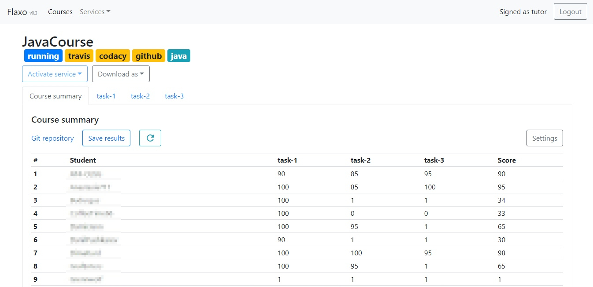
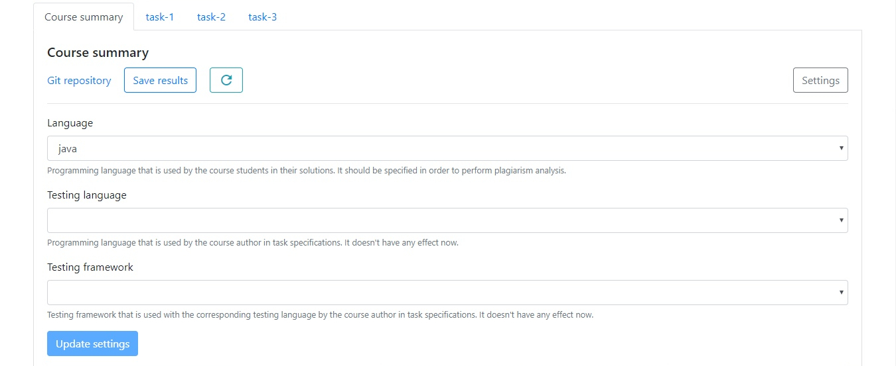

# Course

Educational course is one of the core Flaxo concepts.
Each Flaxo course has a backing git repository where all tasks, tests and documentation are stored 
and there most of the magic happen.

## Creation

To create a new educational course follow the instructions below.

1. Go to the courses page.

2. Click on the **Create course** button. Course creation popup will appear.
*Note that if the button is inactive then you should 
[connect your GitHub account](https://flaxo.readthedocs.io/en/latest/getting-started/external-services/#connect-account)
first*.

3. In the appeared course creation popup fill the **Course name**, **Number of tasks** and **Language** fields.
Moreother you can enable 
[environment generation](https://flaxo.readthedocs.io/en/latest/getting-started/course/#environment-generation).

4. To create course click on **Create** button in the course creation popup. 
The popup will be closed and after several seconds the course will appear on the courses page along with the 
corresponding notifications.

### Environment generation

> **Experimental** feature.

Flaxo is able not only to a create a course repo but to generate a whole execution environment for a predefined set 
of configurations. Environment generation means creating and uploading all the sources, binaries and configs required 
for building the repository sources and running the tests.

| Language | Testing language | Testing framework | Build tool |
| -------- | ---------------- | ----------------- | ---------- |
| Java | Java / Kotlin | Junit / Spek | Gradle |
| Kotlin | Kotlin | Junit / Spek | Gradle |
| С++ | Bash | Bash IO* | Bash |

\* - Simple Bash IO testing framework for C++ sources. 
It was written specifically for the case and will be replaced with community-driven framework.
An example of using the framework is [here](https://github.com/tcibinan/simple-cpp-project).

To enable environment generation while creating a course click on **Generate environment** checkbox in a course 
creation popup. Fill **Testing language** and **Testing framework** to specify the environment to generate.

## Details

Course is a dynamic entity which is hard to track.
Flaxo course dashboard is intended to show the information that requires tutor's attention in the first place.
To view a course details click on the course card on the courses page.

### State

Course state describes what kind of interactions course is supposed to have at the moment.

#### Init

Course has been just created and tutor is expected to clone the repository and create tasks.

#### Running

Course is ready for students to clone and solve the tasks.
 
### Labels
  
Each course has an associated set of labels which can be divided to either *service* or *technology* type.

#### Service labels

Service labels describes which kind of services current course uses to host and validate its solutions.

#### Technology labels

Techonology labels describes what languages and frameworks are used in by the course tutor and students.

## Activation

Once a course is created it can be filled with tasks. 
It means that the tutor configure the required infrastructure and creates tests in the corresponding git repository 
branches.
Once it is done course has to be activated. 
Course activation enables all the supported external service validations: automated testing, code static analysis and 
etc.

To activate course click *Start course* button on the course page.

After the course has been activated additional labels will be added and the course will change its state to `running`.
From that point onward course can be accessed by students that will create forks, solve the tasks and create pull 
requests.

If some of the services weren't activated for any reason you can activate them manually using *Activate service* button.

### Codacy

> See the [corresponding issue](https://github.com/tcibinan/flaxo/issues/39) for the latest information.

**IMPORTANT:** There is a pretty harmful issue regarding Flaxo integration with Codacy.
No automated code static analysis will be performed for the course pull request unless the corresponding Codacy project 
is not recreated.
To recreate a Codacy project please **delete the project and then create project with the same name manually using the 
Codacy wizard**.

## Summary

First tab in the course dashboard is course summary tab.
It contains the overall statistics for each student in the course.
Moreover it contains link to the corresponding git repository and course refresh button.

### Repository link

Course corresponding repository can be accessed via the *Git repository* button.

### Refresh

Course integrated services validations can be refreshed using refresh button.

### Settings

Course settings contains several configurable course properties such as language, testing language and testing
framework.
Currently, none of them has any effect on anything but course labels.

Course settings can be accessed using the corresponding button.

 
### Statistics

The most interesting part of the course summary tab is of course progress statistics table.
It contains scores that each student gained through out the course along with an average overall score.

#### Download

Summary statistics can be downloaded in one of the supported formats using the corresponding button.

