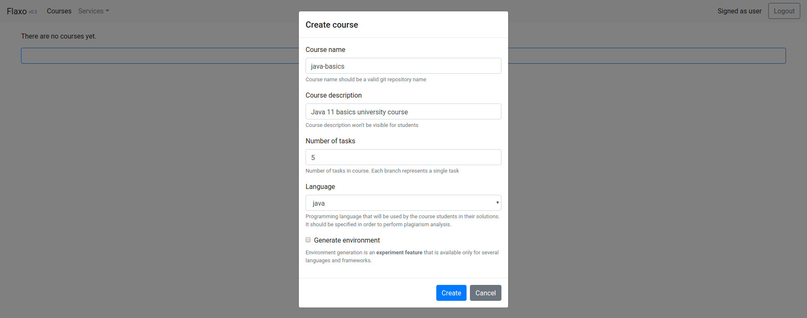

# Course

Educational course is one of the core Flaxo concepts.
Things start to make sense since you've created your first course.

## Create a course

Once you've connect *GitHub* account you are able to create courses.

To create a new educational course follow the instructions below.

1. Go to the courses page.

2. Click on the **Create course** button. Course creation popup will appear.

3. In the appeared course creation popup fill the **Course name**, **Number of tasks** and **Language** fields.

4. To create course click on **Create** button in the course creation popup. 
The popup will be closed and after several seconds the course will appear on the courses page along with the 
corresponding notifications.

### Environment generation

> **Experimental** feature.

Flaxo is able not only to a create a course repo but to generate a whole execution environment for a predefined set 
of configurations. Environment generation means creating and uploading all the sources, binaries and configs required 
for building the repository sources and running the tests.

| Language | Testing language | Testing framework | Build tool |
| -------- | ---------------- | ----------------- | ---------- |
| Java | Java / Kotlin | Junit / Spek | Gradle |
| Kotlin | Kotlin | Junit / Spek | Gradle |
| С++ | Bash | Bash IO* | Bash |

\* - Simple Bash IO testing framework for C++ sources. 
It was written specifically for the case and will be replaced with community-driven framework.
An example of using the framework is [here](https://github.com/tcibinan/simple-cpp-project).

To enable environment generation while creating a course click on **Generate environment** checkbox in a course 
creation popup. Fill **Testing language** and **Testing framework** to specify the environment to generate.

